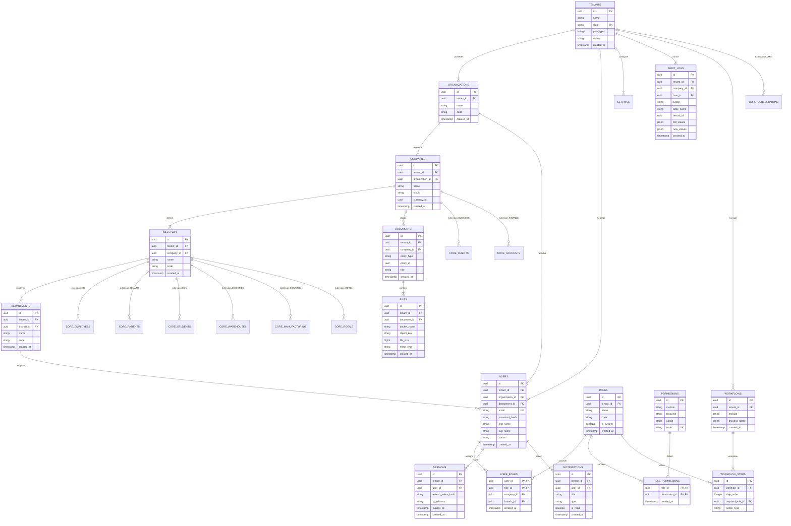

# 📐 DIAGRAMME RELATIONNEL DE LA BASE DE DONNÉES — KOBA ERP CLOUD (DATABASE ERD)

> **Document d'Ingénierie des Données & Schéma E-R**  
> **Projet** : KOBA ERP Cloud  
> **Source de référence** : [`docs/DATABASE_ARCHITECTURE.md`](file:///d:/PROGRAMATION/Application%20web/Koba%20projet%20vrai/docs/DATABASE_ARCHITECTURE.md)  
> **Rôle** : Architecte Base de Données Senior ERP SaaS  
> **Version** : 1.0.0  
> **Statut** : Modèle Relationnel Officiel  

---

# 1. Diagramme Mermaid ERD (KOBA CORE & Extensibilité Métier)

Le diagramme ci-dessous modélise l'ensemble des entités fondamentales du **KOBA CORE** ainsi que les ancrages pour les 9 modules métiers verticaux :



---

# 2. Explication Détaillée des Relations Principales

### 1. Hiérarchie Multi-Tenant & Entités Légales
- **`TENANTS` ➔ `ORGANIZATIONS` (1:N)** : Un compte souscripteur SaaS (`TENANTS`) peut héberger plusieurs holdings ou groupes d'entreprises (`ORGANIZATIONS`).
- **`ORGANIZATIONS` ➔ `COMPANIES` (1:N)** : Une organisation regroupe plusieurs sociétés juridiques immatriculées (`COMPANIES`).
- **`COMPANIES` ➔ `BRANCHES` (1:N)** : Une société juridique est déclinée en plusieurs filiales, sites d'exploitation ou magasins (`BRANCHES`).
- **`BRANCHES` ➔ `DEPARTMENTS` (1:N)** : Une filiale est découpée en départements fonctionnels (`DEPARTMENTS`) comme la Comptabilité, la Paie ou la Logistique.

### 2. Gestion des Utilisateurs & Attribution des Rôles (RBAC)
- **`USERS` ➔ `ORGANIZATIONS` & `DEPARTMENTS` (N:1)** : Un utilisateur est rattaché à une organisation et peut appartenir à un département spécifique.
- **`USERS` ➔ `ROLES` via `USER_ROLES` (N:N)** : Un utilisateur peut cumuler plusieurs rôles. Chaque attribution de rôle dans `USER_ROLES` est explicitement scopée par `company_id` et `branch_id` pour restreindre l'accès à une filiale précise.
- **`ROLES` ➔ `PERMISSIONS` via `ROLE_PERMISSIONS` (N:N)** : Un rôle rassemble un ensemble de permissions atomiques définies dans le catalogue global `PERMISSIONS`.

### 3. Services du Noyau Central (GED, Workflow, Audit)
- **`COMPANIES` ➔ `DOCUMENTS` ➔ `FILES` (1:N:N)** : Les documents métier rattachés à une entreprise pointent vers un ou plusieurs fichiers physiques conservés dans l'infrastructure de stockage MinIO S3.
- **`WORKFLOWS` ➔ `WORKFLOW_STEPS` ➔ `ROLES` (1:N:N)** : Un workflow est une suite ordonnée d'étapes de validation exigeant l'approbation d'un rôle d'utilisateur spécifique.
- **`AUDIT_LOGS` ➔ `USERS` & `TENANTS` (N:1)** : Chaque mutation sensible en base de données enregistre l'utilisateur auteur et l'instantané JSON avant/après la modification.

---

# 3. Ancrages & Extensibilité pour les Modules Métiers Futurs

Toutes les entités des 9 modules métiers verticaux s'ancreront sur les clés primaires de la structure KOBA CORE :

1. **`KOBA BUSINESS`** : Les tables `clients`, `prospects`, `devis`, `factures_ventes` s'ancrent sur `company_id` et `currency_id`.
2. **`KOBA EDU`** : Les tables `étudiants`, `classes`, `enseignants`, `paiements_scolarité` s'ancrent sur `branch_id` et `user_id`.
3. **`KOBA HEALTH`** : Les tables `patients`, `consultations`, `dossiers_médicaux` s'ancrent sur `branch_id` et la GED (`document_id`).
4. **`KOBA FINANCE`** : Les tables `comptes_comptables`, `écritures_comptables`, `exercices` s'ancrent sur `company_id` et l'`audit_logs`.
5. **`KOBA RH`** : Les tables `employés`, `contrats_travail`, `bulletins_paie` s'ancrent sur `department_id`, `user_id` et les `workflows`.
6. **`KOBA HOTEL`** : Les tables `chambres`, `réservations`, `factures_hotel` s'ancrent sur `branch_id` et `company_id`.
7. **`KOBA LOGISTICS`** : Les tables `entrepôts`, `mouvements_stock`, `commandes_achats` s'ancrent sur `branch_id` et les `workflows`.
8. **`KOBA INDUSTRY`** : Les tables `ordres_fabrication`, `nomenclatures_bom`, `postes_charge` s'ancrent sur `branch_id` et `user_id`.
9. **`KOBA ADMIN`** : Les tables `subscriptions`, `invoices_saas`, `tenant_features` s'ancrent directement sur `tenant_id`.

---

# 4. Règles d'Intégrité & Contraintes Structurantes

### 1. Intégrité Référentielle & Clés Étrangères (Foreign Keys)
- **Cascade Delete contrôlé** : Seule la suppression d'un `TENANT` entraîne la suppression en cascade de son organisation et de ses paramètres. 
- **Restrict Delete sur les entités métiers** : Il est formellement interdit de supprimer une `COMPANY` ou un `USER` s'il existe des écritures comptables, factures ou logs d'audit associés (`ON DELETE RESTRICT`).

### 2. Contraintes d'Unicité (Unique Indexes)
- `tenants.slug` : Unique au niveau système.
- `users.email` + `users.tenant_id` : L'adresse email est unique au sein d'un même Tenant.
- `permissions.code` : Code de permission unique au niveau système (ex: `finance:ledger:write`).
- `organizations.code` + `company.code` : Unique au sein de leur entité parente.

### 3. Isolation Multi-Tenant (Row-Level Security)
Toutes les tables métiers comportent la contrainte d'index composite :
```text
CREATE INDEX idx_<table_name>_tenant_isolation ON <table_name> (tenant_id, company_id, branch_id);
```
Cette contrainte garantit que le moteur PostgreSQL / Prisma filtre instantanément le périmètre d'exécution sans analyser les enregistrements des autres tenants.
